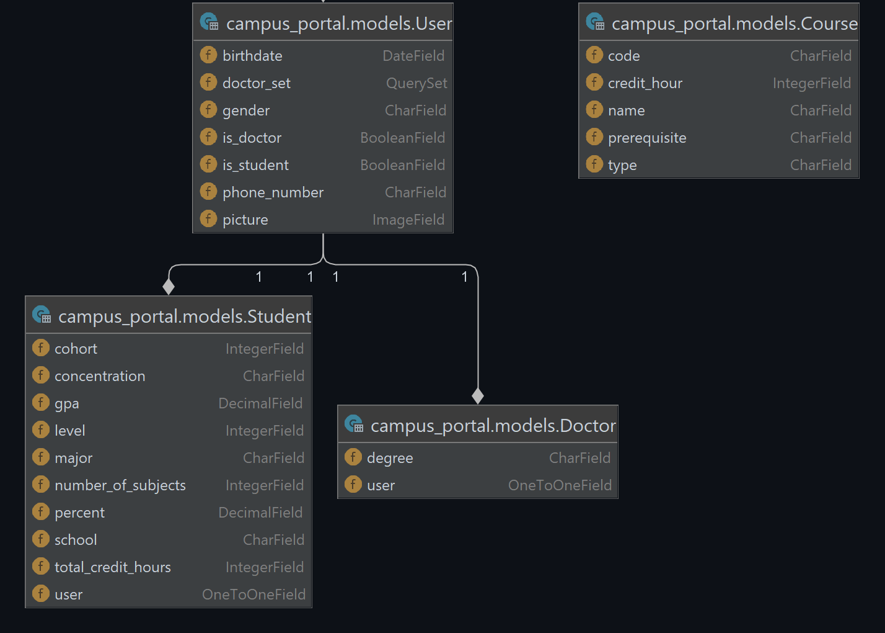

# Campus-Portal

```
                 ____   ____ ____   
                / ___| / ___/ ___|  
                \___ \| |   \___ \  
                 ___) | |___ ___) | 
                |____/ \____|____/  
```

### To Run the project

+ Download the project
+ Make Sure you have python3 installed
+ download requirements using ``` pip install -r requirements.txt``` in CMD
+ move to the Directory
+ Run the following Commands to Run the Django migrations to set up your models and assets

```shell
python manage.py makemigrations
```
```shell
python manage.py migrate
```
```shell
python manage.py sqlmigrate campus_portal 0001
```
#### Then Create a user using the bellow Command
```shell
python manage.py createsuperuser
```
then Enter your username, Email AND password

### Last Step
#### Start the Django web server

```shell
python manage.py runserver
```

+ In your browser, go to http://localhost:8000.

### or 

```shell
python manage.py runserver 0.0.0.0:8000
```

+ In your browser, go to http://192.168.x.x:8000 replace x.x with your local ip

# if You want to visit a live Version, GO to this [Link](https://collegeportal.pythonanywhere.com/) 

### Special Thanks to @Yous10r for this beautiful design

# our Model



